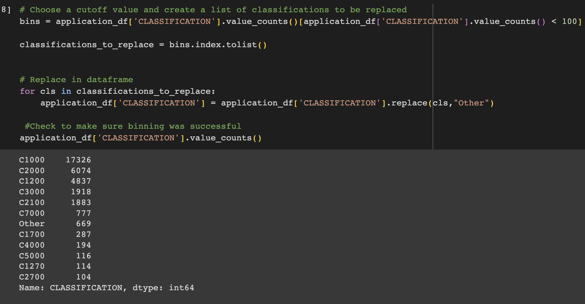
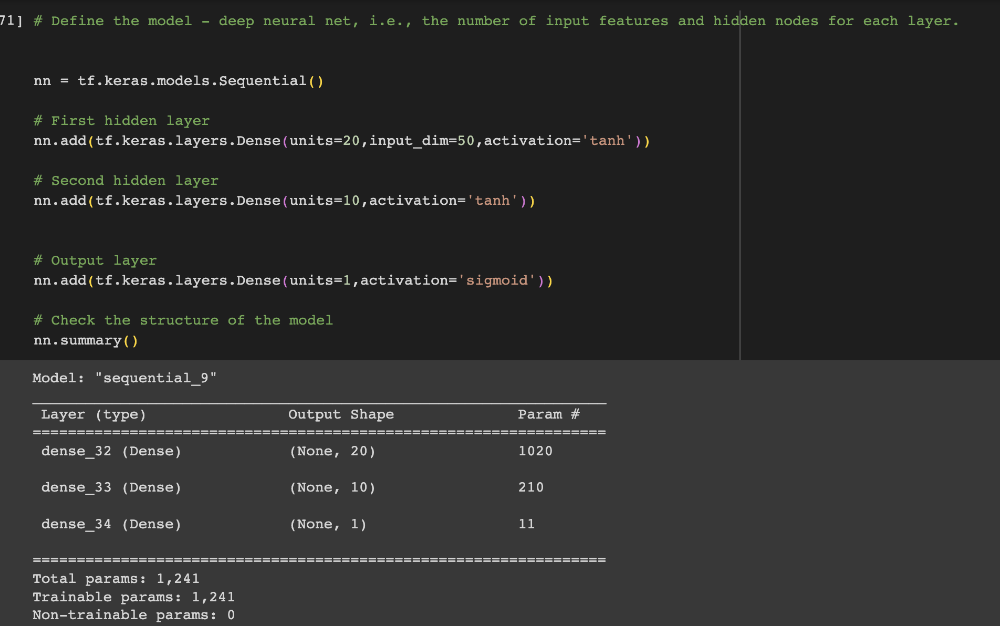

# deep-learning-challenge

## Overview of the Analysis

For this project, we are using historical funding data from non-profit Alphabet Soup to try to predict whether a venture will be successful.  We have data on over 34,000 ventures--including use case, organization type, income amount, how much money they are asking for.  The target variable that we will be using to test the model against is whether or not the venture was successful.   

We built a neural network in order to try to make predictions a venture's success.  We took the following steps in order to pre-process the data: 
    *Separating the features and the target variables  
    *Splitting the data into testing and training data 
    *Removed EIN and NAME columns, which are neither targets nor features  
    *Scaling the data using StandardScaler 
    *Encode categorical variables using getdummies 
    *Place the rarer instances "APPLICATION TYPE" and "CLASSIFICATION" variabes into an "other" bin  
    
    
## Model Build 

For the model build, we used two hidden layers with 80 and 50 neurons.  The hidden layers use a relu activation function and the output layers uses a sigmoid.  I tried adding additional hidden layers and using different acitivation functions such as tanh, linear, gelu, and selu.  None of these tactics yielded a higher accuracy score.  I also tried dropping various columns, but this also had a negative impact on accuracy.    

    
##Results

After numerous tries at different configurations, I landed on the above model that earned an accuracy score around 73% for the test data.  Ultimately, there is still a lot of room for improvement in this model and I would not recommend the model for assessing whether or not a new venture will be successful.  

It is possible that an supervised learning model such as a logistic regression, decision tree, or random forest could do a better job at predicting venture success.  With more time, I would try some of these different models and also keep trying to drop various columns to see if the model is overfitting on too much data.  

  

